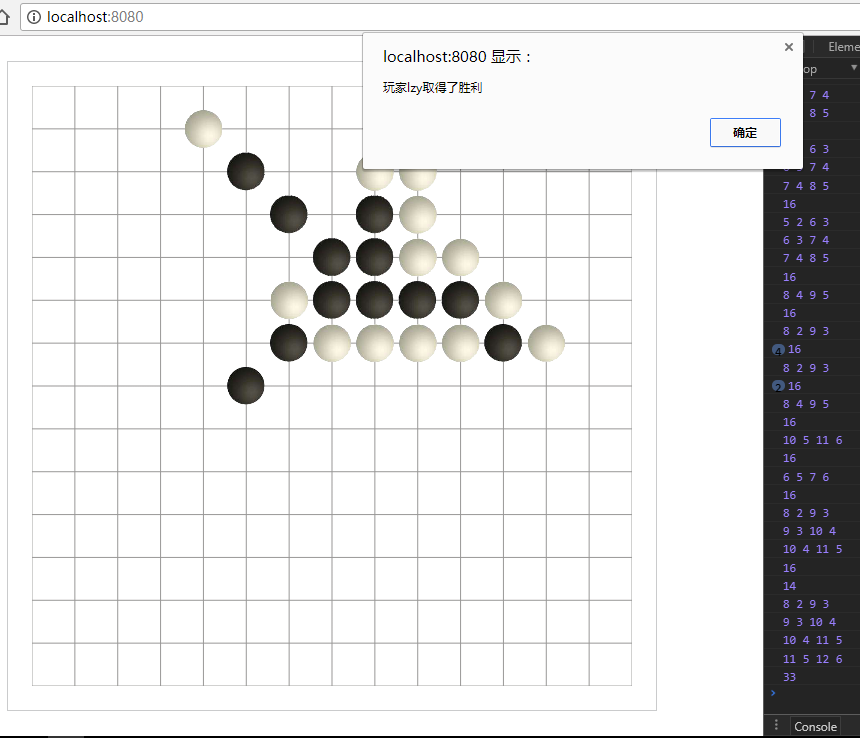

# gomoku
五子棋联机版

实现一个五子棋的游戏，可以联机对战，也可以单机与AI对战

## 如何使用
```
git clone https://github.com/SSnewbie/gomoku.git
npm install
npm run bulid
npm run server
```

## 技术
- `webpack` + `express`+ `socket.io` + `es6`

## 吐槽：

本计划用`gulp`+`ts`,然后配置环境10min后我放弃了，gulp好久没用配置起来十分生疏。一大堆细节和依赖配置很蛋疼。

然后我直接删目录换`webpack`+`ts`,然后配置了半小时。基本可以运行。然后设计目录准备下手时简直懵逼了，（ts没好好学，就是写angular时看了看，不是很熟练，下手时感觉很尴尬，虽然用的是.ts 最后还是写的js风格的代码（雾

......所以我最后选择了不用ts（MDZZ

然后我又删了目录，1个小时过去了

### 进度
可以判断胜负了..

## TODO
### 基本功能
- [X] 棋盘
- [X] 可以轮换落子
- [X] 胜负判断
- [X] 联机
### AI
- [ ] 实现A
I
### 游戏模式（到时候想个酷炫的名字）
前提：A：白棋，B：黑棋
- [ ] 1-普通模式

- [ ] 2-视野盲区
	- A只能看到（白棋）B只能看到（黑棋）
	- 对方下的棋只能显示2S
  - 虽然看不到对方下的棋，但是已落子的地方不能落子，以下所有游戏模式都遵守这个规则

- [ ] 3-互换视野
	- A只能看到B下的棋（黑棋）B只能看到A下的棋（白棋）

- [ ] 视野暂留A（附加1、2、3）
	- 落子后3S内显示可以看到的视野
	- 落子以后3S后，失去所有视野（只是看不到，实际存在）

- [ ] 记忆大师
	- 落子3S后，落下的子在棋盘上消失，（只是看不到，实际存在）

